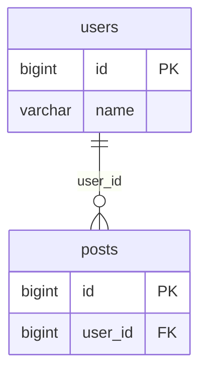

# ER 图

把一条或多条 `CREATE TABLE` 建表语句转成一份 **Mermaid `erDiagram` 源码**：
列出实体、字段（带 PK/FK 标记），并根据外键自动连出一对多关系。纯本地生成，零新依赖。

> **与规划文档的偏差说明**：规划表（03-数据格式.md #185）标注依赖 `mermaid` 做图形渲染。
> 本仓库不新增网络依赖，且 `mermaid` 未安装，因此本工具**只生成 Mermaid 源码文本**，不在页面内渲染成图。
> 复制输出粘贴到任意支持 Mermaid 的环境（GitHub README、Mermaid Live Editor、Typora、语雀等）即可看到图形。

## 用途

快速把数据库 DDL 画成实体关系图：评审表结构、给新人讲库表、写设计文档时生成关系草图。

## 输入

| 字段   | 类型   | 约束                                       |
| ------ | ------ | ------------------------------------------ |
| `text` | string | 最大 200,000 字符；标准 `CREATE TABLE` DDL |

外键两种写法都识别：

- 表级：`FOREIGN KEY (user_id) REFERENCES users (id)`
- 列级：`user_id BIGINT NOT NULL REFERENCES users (id)`

## 输出

Mermaid 源码文本。例如：

约定：

- 关系基数统一画成「一对多」：父表 `||--o{` 子表，关系标签为外键列名
- 主键列标 `PK`，外键列标 `FK`；属性类型取 SQL 类型词（去掉长度 / 精度，转小写）
- 实体名 / 字段名中的非法字符（连字符等）替换为 `_`，数字开头加 `t_` 前缀，以满足 Mermaid 标识符规则

## 限制

- 只解析 `CREATE TABLE`；视图、`ALTER TABLE ADD CONSTRAINT`、多列复合外键（只取首列或忽略）支持有限
- 外键指向的表不在本次 DDL 中时，跳过该关系线（字段仍保留但不强行连线）
- 不区分一对一 / 多对多，统一按一对多呈现；不渲染、不导出 PNG/SVG（请在外部 Mermaid 环境渲染）
- 不连接数据库；识别不到建表语句时抛 `ErDiagramError`

## 数据流向

**纯本地处理。** DDL 仅在浏览器内存中解析，不发送网络请求。`meta.api = false`。

## 元信息

| 项       | 值                        |
| -------- | ------------------------- |
| 全局编号 | #185                      |
| 域       | `data-format`（数据格式） |
| 大组     | `dev`                     |
| 优先级   | P2                        |
| 可行性   | A（纯 JS，仅生成源码）    |
| 模板     | T2（双栏）                |
