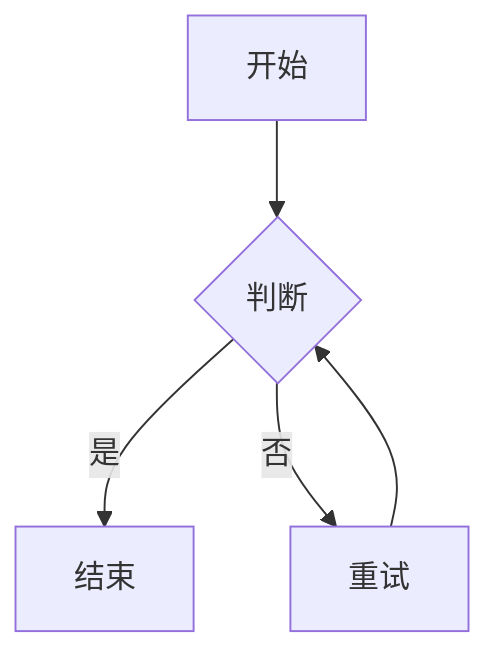

# 流程图

左侧编写 Mermaid flowchart 代码，右侧实时渲染为 SVG 预览；自动补全 `flowchart TD/LR` 方向头部。可复制 / 下载源码（`.mmd`）。

## 用途

- 画业务流程、算法流程、状态流转图
- 调试 Mermaid flowchart 语法（渲染失败会给出中文错误）
- 导出 `.mmd` 源码，粘贴到文档 / Wiki 里复用

## 输入

| 字段   | 类型   | 约束                                 |
| ------ | ------ | ------------------------------------ |
| `text` | string | Mermaid flowchart 代码（留空用示例） |

若输入未写 `flowchart TD/LR` 头部，工具会按所选方向自动补上，无需手写。

## 输出

- 右侧预览区：渲染后的 SVG 流程图（mermaid 在浏览器本地渲染）
- 复制 / 下载：补全后的 Mermaid 源码（`.mmd` 文件）

## 选项

| 选项 | 默认值 | 范围 / 约束 | 说明                |
| ---- | ------ | ----------- | ------------------- |
| 方向 | `TB`   | TB / LR     | 自上而下 / 自左向右 |

## 边界

- 空输入 → 右侧显示引导文案，不报错
- Mermaid 语法错误 → 「渲染失败」提示
- 输入超过 20,000 字符 → 截断至前 20,000 字符再渲染，并在预览区顶部说明

## 示例

## 数据流向

纯本地：代码只在**浏览器内**由 mermaid 渲染为 SVG，不上传到任何服务器。

## 元信息

| 项       | 值                              |
| -------- | ------------------------------- |
| 全局编号 | #399                            |
| 域       | `random`                        |
| 大组     | `design`                        |
| 优先级   | P2                              |
| 可行性   | A（纯前端，mermaid 本地渲染）   |
| 模板     | T3（左代码右预览）              |
| 依赖     | `mermaid`（动态导入，独立分包） |

---

# Flowchart (English)

Write Mermaid flowchart code on the left; the right panel renders a live SVG preview. The `flowchart TD/LR` direction header is auto-completed. Copy or download the source (`.mmd`).

## Purpose

- Draw business / algorithm / state flow diagrams
- Debug Mermaid flowchart syntax (render failures show a Chinese error)
- Export `.mmd` source for reuse in docs / wikis

## Input

| Field  | Type   | Constraint                               |
| ------ | ------ | ---------------------------------------- |
| `text` | string | Mermaid flowchart code (empty = example) |

If the input lacks a `flowchart TD/LR` header, it is auto-prepended with the chosen direction.

## Output

- Right preview panel: rendered SVG (local mermaid render)
- Copy / download: completed Mermaid source (`.mmd` file)

## Options

| Option    | Default | Constraint | Description                   |
| --------- | ------- | ---------- | ----------------------------- |
| Direction | `TB`    | TB / LR    | Top-to-bottom / left-to-right |

## Edge cases

- Empty input → hint shown, no error
- Mermaid syntax error → "render failed"
- Over 20,000 chars → truncated with a notice

## Data flow

Fully local: code is rendered to SVG in the browser by mermaid.

## Meta

| Item        | Value                              |
| ----------- | ---------------------------------- |
| Global No.  | #399                               |
| Category    | `random`                           |
| Group       | `design`                           |
| Priority    | P2                                 |
| Feasibility | A (frontend, mermaid local render) |
| Template    | T3 (code left, preview right)      |
| Deps        | `mermaid` (dynamic import)         |
