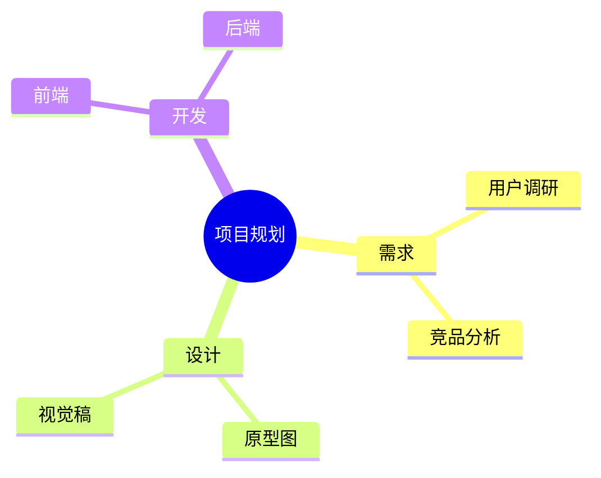

# 思维导图

左侧编写 Mermaid mindmap 代码，右侧实时渲染为 SVG 预览；可复制 / 下载源码（`.mmd`）。

## 用途

- 画项目规划、学习路线、知识结构等思维导图
- 调试 Mermaid mindmap 语法（渲染失败会给出中文错误）
- 导出 `.mmd` 源码，粘贴到文档 / Wiki 里复用

## 输入

| 字段   | 类型   | 约束                               |
| ------ | ------ | ---------------------------------- |
| `text` | string | Mermaid mindmap 源码（留空用示例） |

首个非空行必须是 `mindmap`，否则视为放错了图类型并报错。

## 输出

- 右侧预览区：渲染后的 SVG 思维导图（mermaid 在浏览器本地渲染）
- 复制 / 下载：当前输入框的 Mermaid 源码（`.mmd` 文件）

## 选项

本工具无选项。

## 边界

- 空输入 → 右侧显示引导文案，不报错
- 首行不是 `mindmap` → 报错
- Mermaid 语法错误 → 「渲染失败」提示
- 输入超过 20,000 字符 → 截断至前 20,000 字符再渲染，并在预览区顶部说明

## 示例

## 数据流向

纯本地：代码只在**浏览器内**由 mermaid 渲染为 SVG，不上传到任何服务器。

## 元信息

| 项       | 值                              |
| -------- | ------------------------------- |
| 全局编号 | #398                            |
| 域       | `random`                        |
| 大组     | `design`                        |
| 优先级   | P2                              |
| 可行性   | A（纯前端，mermaid 本地渲染）   |
| 模板     | T3（左代码右预览）              |
| 依赖     | `mermaid`（动态导入，独立分包） |

---

# Mind Map (English)

Write Mermaid mindmap code on the left; the right panel renders a live SVG preview. Copy or download the source (`.mmd`).

## Purpose

- Draw project plans, study paths, knowledge structures as mind maps
- Debug Mermaid mindmap syntax (render failures show a Chinese error)
- Export `.mmd` source for reuse in docs / wikis

## Input

| Field  | Type   | Constraint                               |
| ------ | ------ | ---------------------------------------- |
| `text` | string | Mermaid mindmap source (empty = example) |

The first non-empty line must be `mindmap`.

## Output

- Right preview panel: rendered SVG (local mermaid render)
- Copy / download: Mermaid source (`.mmd` file)

## Options

None.

## Edge cases

- Empty input → hint shown, no error
- First line is not `mindmap` → error
- Mermaid syntax error → "render failed"
- Over 20,000 chars → truncated with a notice

## Data flow

Fully local: code is rendered to SVG in the browser by mermaid.

## Meta

| Item        | Value                              |
| ----------- | ---------------------------------- |
| Global No.  | #398                               |
| Category    | `random`                           |
| Group       | `design`                           |
| Priority    | P2                                 |
| Feasibility | A (frontend, mermaid local render) |
| Template    | T3 (code left, preview right)      |
| Deps        | `mermaid` (dynamic import)         |
