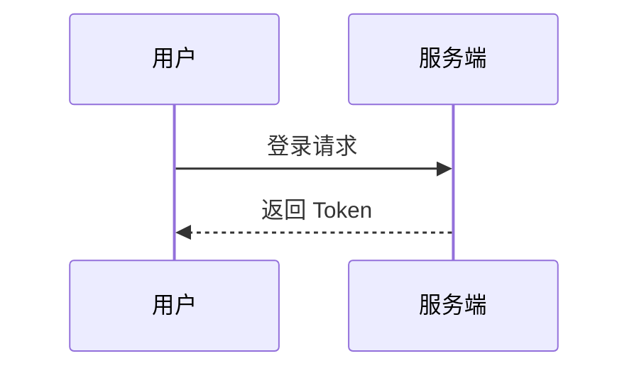
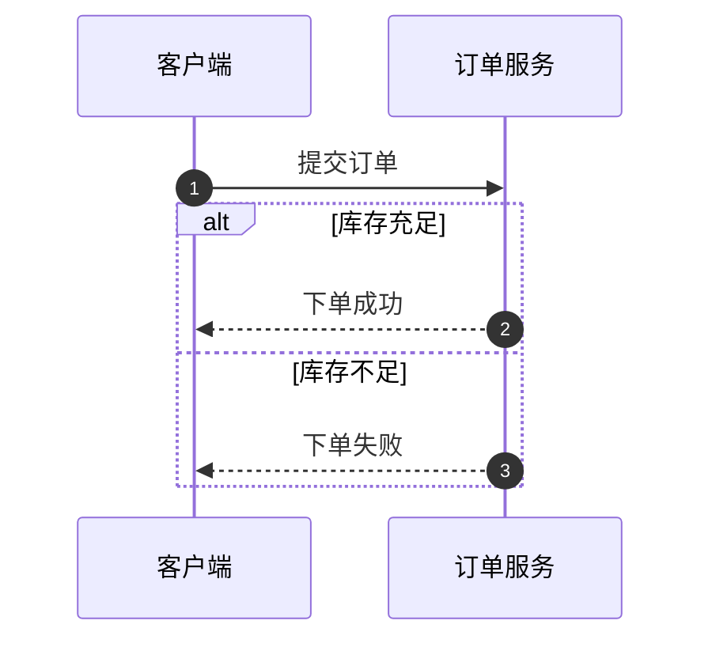
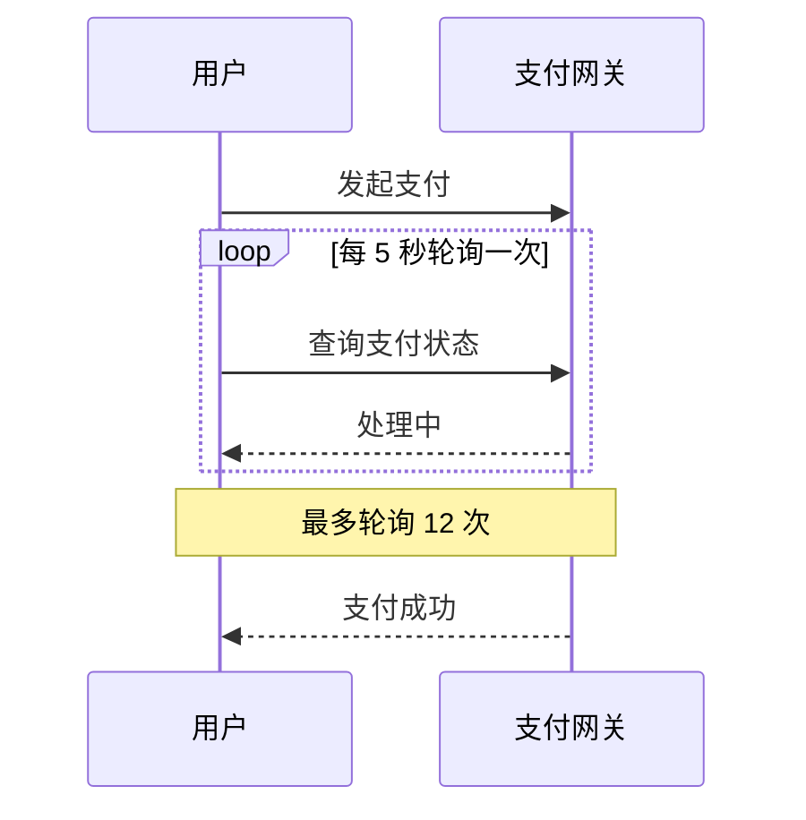
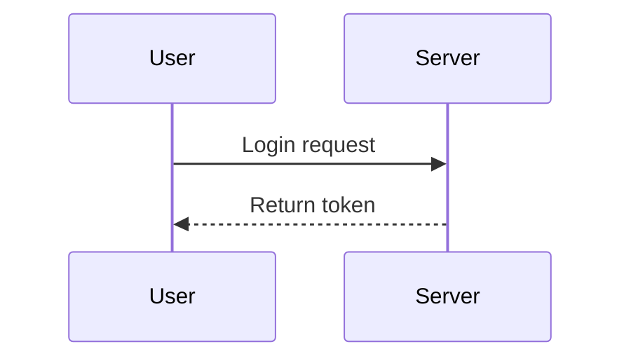
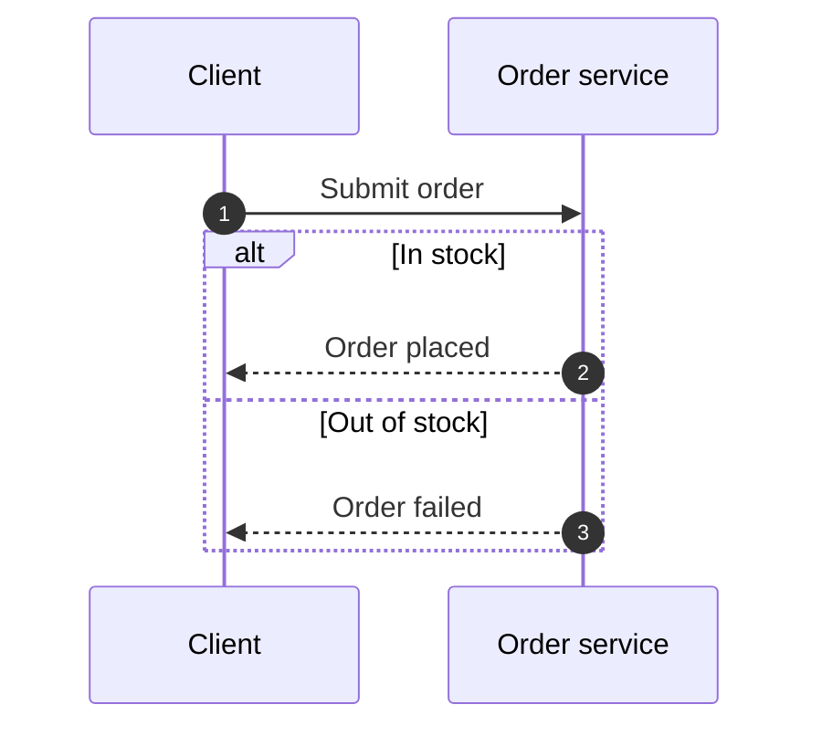
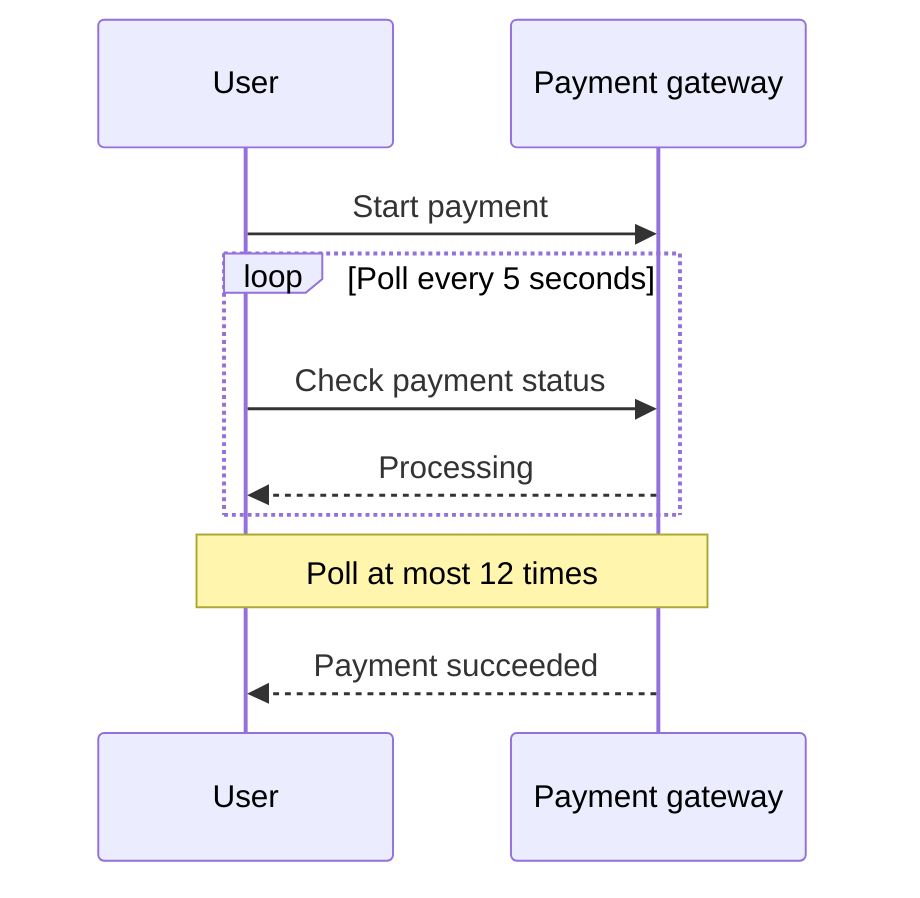

# 时序图

左侧编写 Mermaid 时序图（`sequenceDiagram`）代码，右侧实时渲染为 SVG 预览；可复制 / 下载源码（`.mmd`）。

## 用途

- 画接口调用、登录流程、订单链路等时序图
- 调试 Mermaid 时序图语法（渲染失败会给出中文 / 英文双语错误）
- 导出 `.mmd` 源码，粘贴到文档 / Wiki 里复用

## 输入

| 字段   | 类型   | 约束                       |
| ------ | ------ | -------------------------- |
| `text` | string | Mermaid 时序图源码（必填） |

首个非空行必须是 `sequenceDiagram`，否则视为放错了图类型并报错。

## 输出

- 右侧预览区：渲染后的 SVG 图（mermaid 在浏览器本地渲染）
- 复制 / 下载：当前输入框的 Mermaid 源码（`.mmd` 文件）

## 选项

本工具无选项。

## 边界

- 空输入 → 右侧显示引导文案，不报错
- 首行不是 `sequenceDiagram` → 双语报错（如误粘了流程图代码）
- Mermaid 语法错误 → 双语「渲染失败」提示
- 输入超过 20,000 字符 → 截断至前 20,000 字符再渲染，并在预览区顶部说明
- 特殊字符（`<>&"'` 等）原样透传，不转义不删减；渲染时 mermaid 以 `strict` 安全级别过滤注入

## 示例

### 示例 1：登录时序（「示例」按钮填入）

### 示例 2：带分支的下单流程

### 示例 3：带轮询与备注的支付流程

## 数据流向

纯本地：代码只在**浏览器内**由 mermaid 渲染为 SVG，不上传到任何服务器。

## 元信息

| 项       | 值                                                     |
| -------- | ------------------------------------------------------ |
| 全局编号 | #400                                                   |
| 域       | `random`（随机 / 生成 / 设计）                         |
| 大组     | `design`                                               |
| 优先级   | P2                                                     |
| 可行性   | A（纯前端，mermaid 本地渲染）                          |
| 模板     | T3（左代码右预览；T2 右栏为纯文本，无法承载 SVG 预览） |
| 依赖     | `mermaid`（动态导入，独立分包）                        |

---

# Sequence Diagram (English)

Write Mermaid sequence diagram (`sequenceDiagram`) code on the left; the right panel renders a live SVG preview. Copy or download the source (`.mmd`).

## Purpose

- Draw sequence diagrams for API calls, login flows, order pipelines, etc.
- Debug Mermaid sequence syntax (render failures show a bilingual error)
- Export `.mmd` source for reuse in docs / wikis

## Input

| Field  | Type   | Constraint                                 |
| ------ | ------ | ------------------------------------------ |
| `text` | string | Mermaid sequence diagram source (required) |

The first non-empty line must be `sequenceDiagram`; otherwise the tool reports that the wrong diagram type was pasted.

## Output

- Right preview panel: the rendered SVG (rendered locally in the browser by mermaid)
- Copy / download: the Mermaid source from the input box (as an `.mmd` file)

## Options

None.

## Edge cases

- Empty input → a hint is shown on the right, no error
- First line is not `sequenceDiagram` → bilingual error (e.g. flowchart code pasted by mistake)
- Mermaid syntax error → bilingual "render failed" message
- Input over 20,000 characters → truncated to the first 20,000 characters before rendering, with a notice above the preview
- Special characters (`<>&"'` etc.) pass through untouched; mermaid renders with `strict` security level to filter injections

## Examples

### Example 1: login flow (filled by the "Example" button)

### Example 2: order flow with branches

### Example 3: payment flow with polling and notes

## Data flow

Fully local: the code is rendered to SVG **inside the browser** by mermaid; nothing is uploaded to any server.

## Meta

| Item        | Value                                                                                         |
| ----------- | --------------------------------------------------------------------------------------------- |
| Global No.  | #400                                                                                          |
| Category    | `random`                                                                                      |
| Group       | `design`                                                                                      |
| Priority    | P2                                                                                            |
| Feasibility | A (frontend only, mermaid renders locally)                                                    |
| Template    | T3 (code left, preview right; T2's right column is plain text and cannot host an SVG preview) |
| Deps        | `mermaid` (dynamically imported, separate chunk)                                              |
